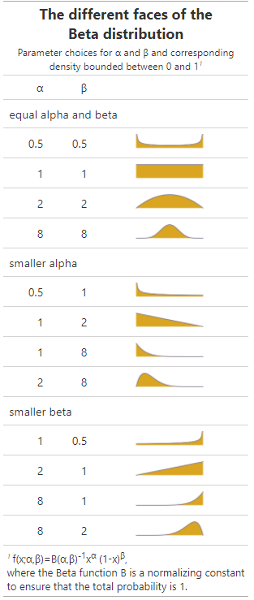

I was playing around with the different faces of the Beta distribution.

Depending on the parameters alpha and beta, the distribution takes very distinct shapes.

I submitted this table to the RStudio [Table Contest](https://blog.rstudio.com/2020/09/15/announcing-the-2020-rstudio-table-contest/) and uploaded the table [here](https://beta-dist-table.netlify.app/)

