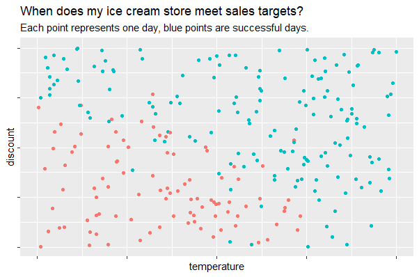
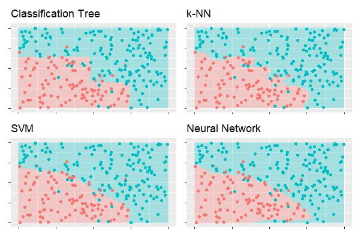
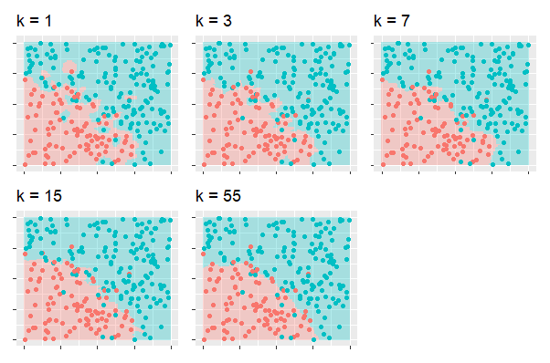

## Decision boundaries

In supervised Machine Learning tasks, we use algorithms that help us to take decisions. These algorithms require data to learn from. Take the example of a binary classificaction task. 
Here, we only have two possible outcomes.

An easy example is the ice cream store which wants to predict if it can meet the sales target on a given day. 

We observe, that when temperatures are high or if the discount is high enough, the sales target is reached.
If we see the predicted temperature of the next day and the discount that we are going to offer, how can we know if we are going to meet the sales target?

When we train Machine Learning algorithms, they use this data to find decision areas. This makes it easier to predict. Let's see how some of the most popular algorithms would separate our ice cream example:

Each algorithm depends on parameters. If we play around with those, we can create better areas. This can also be used to explain the concept of over- and underfitting.

