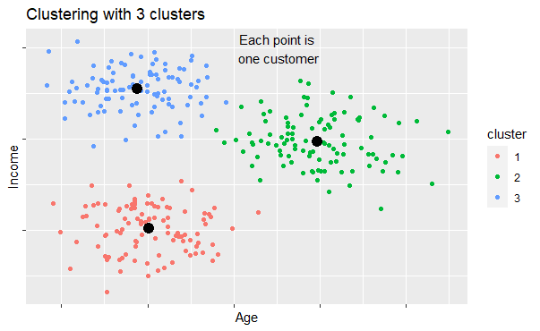
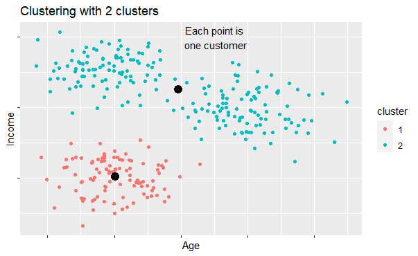
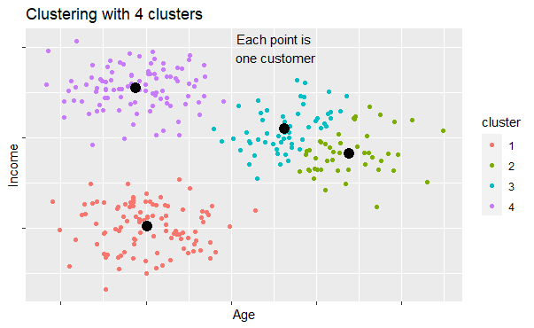
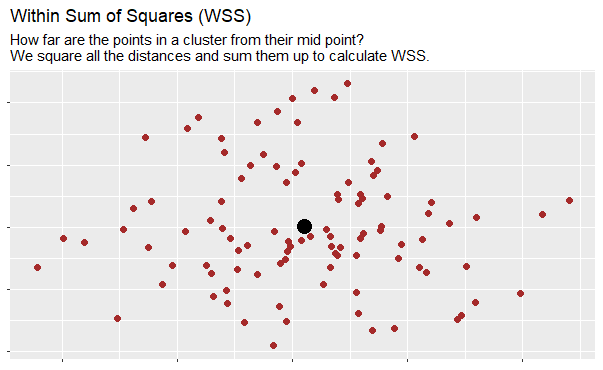
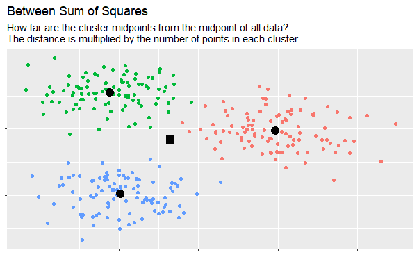
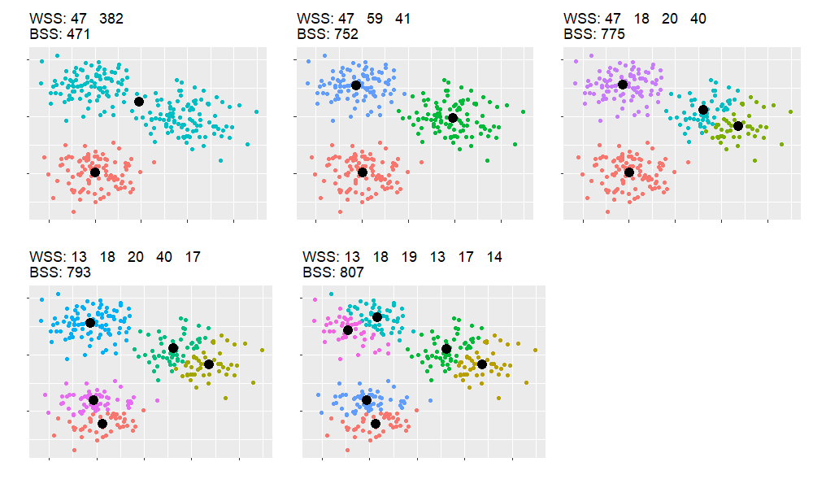
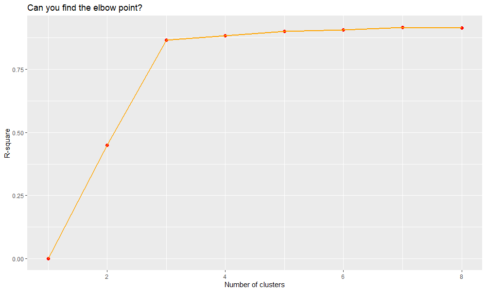

# Data-Simulation

When I want to get people enthusiastic about R, I recommend them to find a real world dataset about a topic they are passionate about. The world is full of data and it was never easier to find data related to a certain topic.

Nevertheless, there are situations where simulating your own data is the best option. I want to show two such examples.

## 1. When explaining basic concepts.

When we move to a more analytical future, we have to replace some things "that have always be done this way" by new methods. In this case, it is important to find a common ground for discussion and explain technical concepts in a compehensible way. When I prepare for such a discussion, I always prepare some simulated datasets which can support the narrative and explain the method.

One example:
Customer segmentation is the key to a successful future of many companies who have to understand their customers' needs and treat each customer as the individual they are. The days of serving the average and having some rough business rules in place are coming to an end. Clustering techniques can help to find groups of similar customers.
But how can we know what is the correct number of clusters? To explain how this can be done, I prepared a few plots with simulated data for a meeting with business partners. I selected variables that they usually work with to make them feel as comfortable as possible in this discussion.

Why do we intuitively say that this is a good clustering, and definitely a better clustering than this?

What about this version?

Can we measure this feeling? There is a method...

First, we need some ingredients to measure how similar the customers within a cluster are and how different the customers from two different clusters are:

Great, now how do these quantities change, when we introduce more clusters?

WSS goes down (the more clusters, the closer the points within a cluster get together), BSS goes up (with more clusters, the cluster mid-points are drifting more and more away from each other). Check the extreme cases (1 cluster vs each point is a cluster) to make these concepts clear.

The R Square value is a weighted value of 1-WSS/(WSS+BSS). With an increasing number of clusters, WSS get smaller, so the R Square will increase until finally reach 1. If we plot the R Square value for different numbers of clusters, we obtain a chart. The elbow point is the point after which the addition of new clusters will not improve the separation of the data into groups. It is a good candidate to consider for the number of clusters.

Of course, there are also other considerations from business side that influence the final decision, but this can be helpful to support the decision.

## 2. When the real data is sensitive
Companies usually protect their customers' data. This is great.

For data analytics companies who put a lot of effort into learning and development it can be challenging to find adecuate datasets with customer datasets to train their employees. Again, data simulation comes to the rescue: We can simulate a complete database with the following properties:

* it is completely made-up, zero risk to use in any initiative.
* it is so sophisticated that young analysts can use it to practice their data analytics and storytelling capabilities.
* it is large, so that analysts learn to write efficient code.
* it is available to everybody in the company, training initiatives and individuals.
* it is accessible from RStudio, Python and pgAdmin containers.

The code file about Data Simulation shows how we can use the great capabilities of R to create such a database.
